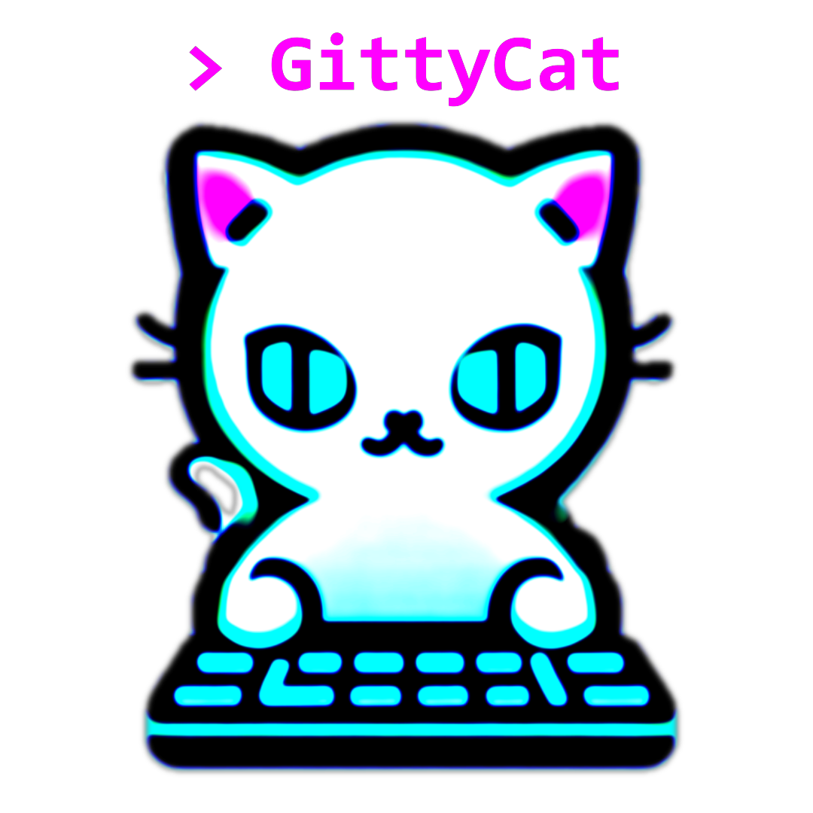

# sw-gittycat-server
GittyCat, as the name suggests, merges the principles of 'Git', the version control system, and 'Concatenate', reflecting the tool's ability to string together CI/CD pipelines. This open-source, Go-based, self-hosted CI/CD webhook listener system effectively 'concatenates' your (not only) Git workflows, bringing together a secure and efficient, scalable CI/CD solution.




# UNDER DEVELOPMENT

An open-source, self-hosted CI/CD system and weebhook listener that is designed to provide a seamless and secure experience for continuous integration and deployment. GittyCat enables the execution of automated workflows for your CI/CD needs.

Developed in Go, GittyCat natively supports a wide range of architectures including 386, arm, arm64, and amd64. 
Its versatility extends to the operating systems it can function on, with robust support for FreeBSD, Linux, macOS, and Windows.

One of the key focus of GittyCat is its cloning from virtually any service that allows it, including GitHub, Gitea, other services and also private repositorys.


## Current view of feature set and planned features:

| Feature | Not planned | Planned | Implemented |
| --- | --- | --- | --- |
| Clone HTTP |  |  | 🟢 |
| Clone HTTPS |  |  | 🟢 |
| Clone SSH |  |  | 🟢 |
| YAML github workflows |  |  | 🟢 |
| Source stage |  |  | 🟢 |
| Build stage |  | 🟡 |  |
| Test stage |  | 🟡 |  |
| Deploy stage |  | 🟡 |  |
| Webhook trigger |  |  | 🟢 |
| Webinterface HTTPS/HTTPS |  | 🟡 |  |
| Gitea integration |  | 🟡 |  |
| Docker integration |  | 🟡 |  |
| OAuth  |  | 🟡 |  |

## Usage

1. Clone this repository to the path you want to operate your gittycat-server instance. A good place could be the `/opt/` folder since this software will have it's own specific structure. So navigate to `/opt/`
  ```
  cd /opt
  ```
And now clone this repository
  ```
  git clone https://github.com/passon-engineering/sw-gittycat-server.git
  ```

2. Navigate to the cloned repository
  ```
  cd sw-gittycat-server
  ```
  and build the project to create the binary (make sure you use go >1.20)
  ```
  go build -o gittycat-server main.go
  ```

3. Before you start the application, make sure that if you try to access private repositories the server has your public SSH key. If you need to create the key follow the steps:

  Since this SW needs root permision, switch to the super user
  ```
  sudo su -
  ```
  or (depending on your system)
  ```
  su -
  ```
  Now create the keys (never share your private key!)
  ```
  ssh-keygen -t rsa -b 4096 -C "youremail@example.com"
  ```
  Read the content and add it to your trusted keys
  ```
  cat ~/.ssh/id_rsa.pub
  ```